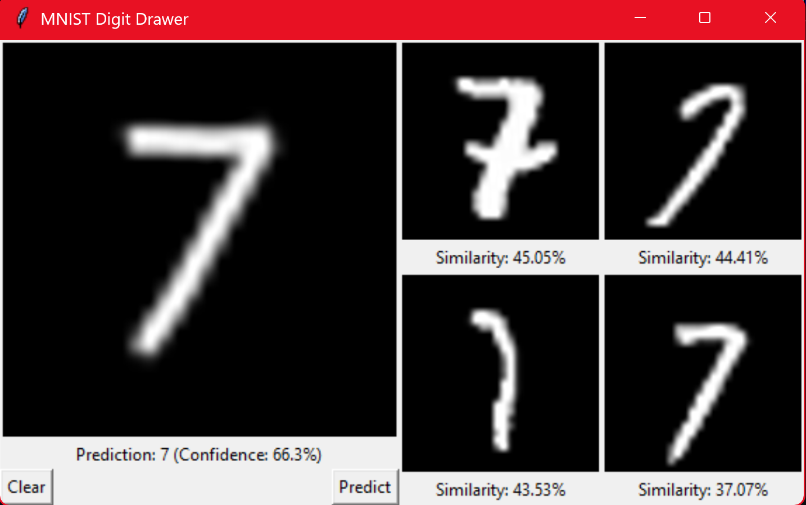
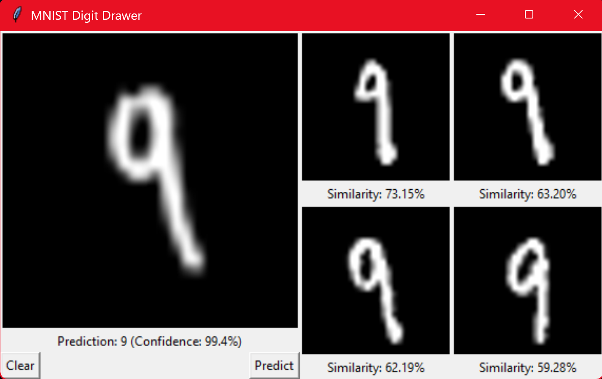

# MNIST Hello World (PyTorch)




## Overview

- Trains a simple neural net on MNIST.
- Saves model as `mnist_model.pth`.
- Tkinter GUI to draw and predict digits.
- Shows top 4 similar MNIST samples (SSIM).

## Quickstart

1. (Recommended) Create and activate a virtual environment:
   ```bash
   python -m venv .venv
   # On Windows:
   .venv\Scripts\activate
   # On macOS/Linux:
   source .venv/bin/activate
   ```

2. Install dependencies:
   ```bash
   pip install -r requirements.txt
   ```
3. Train or test locally:
   ```bash
   python mnist_nn.py
   ```
4. Use the notebook (free GPU):
   - Open `mnist_nn.ipynb` in VS Code and run with the Colab extension.
   - Or, upload to Google Colab and:
     - Select the `Runtime` tab
     - Click `Change runtime type`
     - Choose `T4 GPU` (or any other better GPUs if available, might be overkill though)

## Notes / Future

- May add top 4 for MSE (Mean Squared Error) to the right of SSIM later.
- Notebook saves trained model with download link; could add to script.

